**********
Benchmarks
**********

All the following benchmarks have been carried out on an i7-8750H(with OpenMP enabled, this is 12 threads), with Intel's icpc (ICC) 19.0.1.144 compiler and Eigen version 3.3.7, with ``DTYPE`` set to ``double``. The compiler flags that were utilized are the same are those mentioned in the ``CMakeLists.txt`` file.

Presented below are the results as obtained when using different kernels:

Gaussian Kernel
###############

The Gaussian Kernel is given by :math:`K(i, j) = \sigma^2 \delta_{ij}^2 + \exp(-||x_i - x_j||^2)`. For these benchmarks, we take :math:`\sigma = 10` with :math:`x` being set as a sorted random vector :math:`\in (-1, 1)`. Using the ``plotTree`` function of this library, we can look at the rank structure for this matrix. The following diagram is obtained with :math:`N = 10000`, :math:`M = 500` and tolerance :math:`10^{-12}`

.. image:: images/gaussian_rank_structure.svg
   :width: 400

The green blocks are low-rank blocks. Their intensity of color shows their degree of "low-rankedness". Additionally, the rank has been displayed in each of these blocks. The red blocks are full-rank blocks and would have the rank of :math:`M = 500`

Time Taken vs Tolerance
~~~~~~~~~~~~~~~~~~~~~~~

For these benchmarks the size of the matrix :math:`N = 1000000`, with the size of the leaf node set to :math:`M = 100`.

Fast Factorization
^^^^^^^^^^^^^^^^^^

+----------------+------------+---------+------------+--------+--------------+
|Tolerance       | Assembly(s)|MatVec(s)|Factorize(s)|Solve(s)|Determinant(s)|
+================+============+=========+============+========+==============+ 
|:math:`10^{-2}` | 1.65059    |11.4442  |1.47112     |0.321805|0.0300901     |
+----------------+------------+---------+------------+--------+--------------+ 
|:math:`10^{-4}` | 1.82825    |8.33693  |1.94887     |0.337377|0.03039       |
+----------------+------------+---------+------------+--------+--------------+ 
|:math:`10^{-6}` | 1.92681    |12.4077  |2.33157     |0.346198|0.0300648     |
+----------------+------------+---------+------------+--------+--------------+
|:math:`10^{-8}` | 2.09475    |11.5901  |2.74718     |0.361579|0.0338411     |
+----------------+------------+---------+------------+--------+--------------+ 
|:math:`10^{-10}`| 2.28711    |11.8123  |3.22611     |0.375279|0.0296249     |
+----------------+------------+---------+------------+--------+--------------+ 
|:math:`10^{-12}`| 2.54764    |11.2157  |3.89779     |0.398319|0.0305111     |
+----------------+------------+---------+------------+--------+--------------+ 
|:math:`10^{-14}`| 2.95124    |8.55489  |5.01199     |0.431082|0.0309851     | 
+----------------+------------+---------+------------+--------+--------------+ 

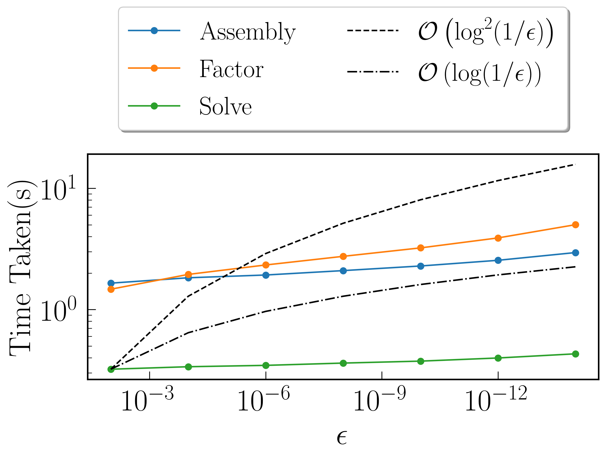

Fast Symmetric Factorization
^^^^^^^^^^^^^^^^^^^^^^^^^^^^

+----------------+------------+---------+------------+--------+--------------+----------------+
|Tolerance       | Assembly(s)|MatVec(s)|Factorize(s)|Solve(s)|Determinant(s)|MultSymFactor(s)|
+================+============+=========+============+========+==============+================+ 
|:math:`10^{-2}` | 1.61076    |11.4741  |1.17726     |0.387992|0.0366111     |0.226509        |
+----------------+------------+---------+------------+--------+--------------+----------------+ 
|:math:`10^{-4}` | 1.81511    |8.08747  |1.56692     |0.399085|0.0328679     |0.249969        |
+----------------+------------+---------+------------+--------+--------------+----------------+ 
|:math:`10^{-6}` | 1.91956    |12.3341  |1.83361     |0.418334|0.031215      |0.266352        |
+----------------+------------+---------+------------+--------+--------------+----------------+ 
|:math:`10^{-8}` | 2.07343    |11.2653  |2.29376     |0.440591|0.0327439     |0.288697        |
+----------------+------------+---------+------------+--------+--------------+----------------+ 
|:math:`10^{-10}`| 2.24097    |11.7877  |2.86431     |0.464687|0.0305729     |0.339399        |
+----------------+------------+---------+------------+--------+--------------+----------------+ 
|:math:`10^{-12}`| 2.57603    |11.3027  |3.66516     |0.494536|0.031522      |0.393104        |
+----------------+------------+---------+------------+--------+--------------+----------------+ 
|:math:`10^{-14}`| 2.90611    |7.89484  |4.93738     |0.537149|0.030225      |0.393285        | 
+----------------+------------+---------+------------+--------+--------------+----------------+ 

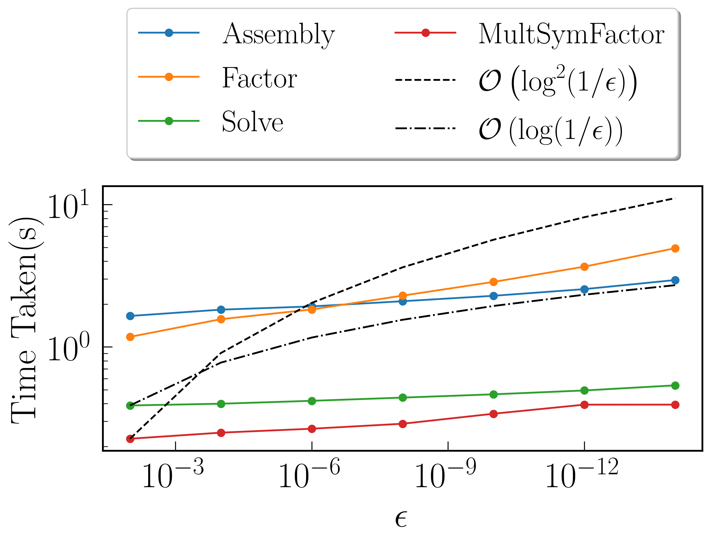

Time Taken vs Size of Matrix
~~~~~~~~~~~~~~~~~~~~~~~~~~~~

For these benchmarks, the leaf size was fixed at :math:`M = 100`, with tolerance set to :math:`10^{-12}`

Fast Factorization
^^^^^^^^^^^^^^^^^^

+-----------------------+------------+------------+------------+-----------+--------------+----------------+
|:math:`N`              | Assembly(s)|MatVec(s)   |Factorize(s)|Solve(s)   |Determinant(s)|Direct LU(s)    |
+=======================+============+============+============+===========+==============+================+
|:math:`10^{3}`         | 0.00345016 |0.000463963 |0.00121403  |0.000246048|2.09808e-05   |0.024302        |
+-----------------------+------------+------------+------------+-----------+--------------+----------------+
|:math:`5 \times 10^{3}`| 0.00954294 |0.000818014 |0.00755906  |0.00179601 |0.000159979   |1.61282         |
+-----------------------+------------+------------+------------+-----------+--------------+----------------+
|:math:`10^{4}`         | 0.0180159  |0.00202203  |0.103507    |0.003834   |0.000344992   |10.4102         |
+-----------------------+------------+------------+------------+-----------+--------------+----------------+
|:math:`5 \times 10^{4}`| 0.109816   |0.0147851   |0.103266    |0.022316   |0.00227404    |N/A             |
+-----------------------+------------+------------+------------+-----------+--------------+----------------+
|:math:`10^{5}`         | 0.202525   |0.066885    |0.239639    |0.0450559  |0.00451112    |N/A             |
+-----------------------+------------+------------+------------+-----------+--------------+----------------+
|:math:`5 \times 10^{5}`| 1.19365    |3.68382     |1.6615      |0.206754   |0.015748      |N/A             |
+-----------------------+------------+------------+------------+-----------+--------------+----------------+
|:math:`10^{6}`         | 2.53519    |11.1435     |3.93549     |0.399695   |0.0303771     |N/A             |
+-----------------------+------------+------------+------------+-----------+--------------+----------------+

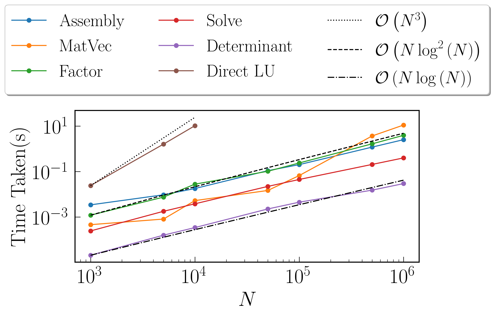

Fast Symmetric Factorization
^^^^^^^^^^^^^^^^^^^^^^^^^^^^

+-----------------------+------------+-----------+------------+----------+--------------+----------------+------------------+
|:math:`N`              | Assembly(s)|MatVec(s)  |Factorize(s)|Solve(s)  |Determinant(s)|MultSymFactor(s)|Direct Cholesky(s)|
+=======================+============+===========+============+==========+==============+================+==================+
|:math:`10^{3}`         | 0.00344396 |0.000510931|0.00103807  |0.00030303|2.19345e-05   |0.000180006     |0.0316679         |
+-----------------------+------------+-----------+------------+----------+--------------+----------------+------------------+
|:math:`5 \times 10^{3}`| 0.00925708 |0.000812054|0.00626493  |0.00209403|0.000108004   |0.00113392      |2.35399           |
+-----------------------+------------+-----------+------------+----------+--------------+----------------+------------------+
|:math:`10^{4}`         | 0.0183232  |0.00199389 |0.010865    |0.00471711|0.000352859   |0.00263691      |18.5745           |
+-----------------------+------------+-----------+------------+----------+--------------+----------------+------------------+
|:math:`5 \times 10^{4}`| 0.0946209  |0.0151899  |0.0787759   |0.0285201 |0.00230503    |0.0157571       |N/A               |
+-----------------------+------------+-----------+------------+----------+--------------+----------------+------------------+
|:math:`10^{5}`         | 0.203769   |0.0659761  |0.183974    |0.058074  |0.00438595    |0.03263         |N/A               |
+-----------------------+------------+-----------+------------+----------+--------------+----------------+------------------+
|:math:`5 \times 10^{5}`| 1.18639    |3.67825    |1.47418     |0.245743  |0.0180571     |0.162066        |N/A               |
+-----------------------+------------+-----------+------------+----------+--------------+----------------+------------------+
|:math:`10^{6}`         | 2.53567    |11.2973    |3.56786     |0.488049  |0.0311899     |0.377352        |N/A               |
+-----------------------+------------+-----------+------------+----------+--------------+----------------+------------------+

Matérn Kernel
#############

Kernel considered is given by :math:`K(r) = \sigma^2 \left(1 + \frac{r \sqrt{5}}{\rho} + \frac{5 r^2}{3 \rho^2}\right)\exp{\left(-\frac{r \sqrt{5}}{\rho}\right)}`. For these benchmarks, we take :math:`\sigma = 10`, :math:`\rho = 5`, where :math:`r = ||x_i - x_j||` with :math:`x` being set as a sorted random vector :math:`\in (-1, 1)`. Using ``plotTree`` for :math:`N = 10000`, :math:`M = 500` and tolerance :math:`10^{-12}`, we get this rank structure

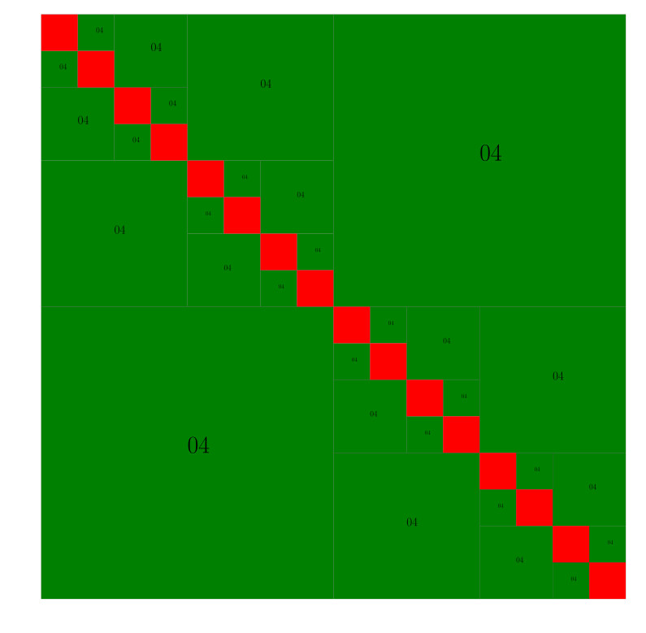

Time Taken vs Tolerance
~~~~~~~~~~~~~~~~~~~~~~~

For these benchmarks the size of the matrix :math:`N = 1000000`, with the size of the leaf node set to :math:`M = 100`.

Fast Factorization
^^^^^^^^^^^^^^^^^^

+----------------+------------+---------+------------+--------+--------------+
|Tolerance       | Assembly(s)|MatVec(s)|Factorize(s)|Solve(s)|Determinant(s)|
+================+============+=========+============+========+==============+ 
|:math:`10^{-2}` | 1.70237    |13.8247  |1.3231      |0.388983|0.042177      |
+----------------+------------+---------+------------+--------+--------------+ 
|:math:`10^{-4}` | 1.93746    |14.0274  |1.37327     |0.401342|0.0430369     |
+----------------+------------+---------+------------+--------+--------------+ 
|:math:`10^{-6}` | 1.99264    |9.29146  |1.6509      |0.413971|0.0420959     |
+----------------+------------+---------+------------+--------+--------------+
|:math:`10^{-8}` | 2.04502    |13.6249  |1.80135     |0.417019|0.043962      |
+----------------+------------+---------+------------+--------+--------------+ 
|:math:`10^{-10}`| 2.08538    |14.7541  |2.1616      |0.455189|0.0420899     |
+----------------+------------+---------+------------+--------+--------------+ 
|:math:`10^{-12}`| 2.28954    |9.11655  |2.27049     |0.431815|0.043808      |
+----------------+------------+---------+------------+--------+--------------+ 
|:math:`10^{-14}`| 2.19898    |13.821   |2.74798     |0.466761|0.0431418     | 
+----------------+------------+---------+------------+--------+--------------+ 

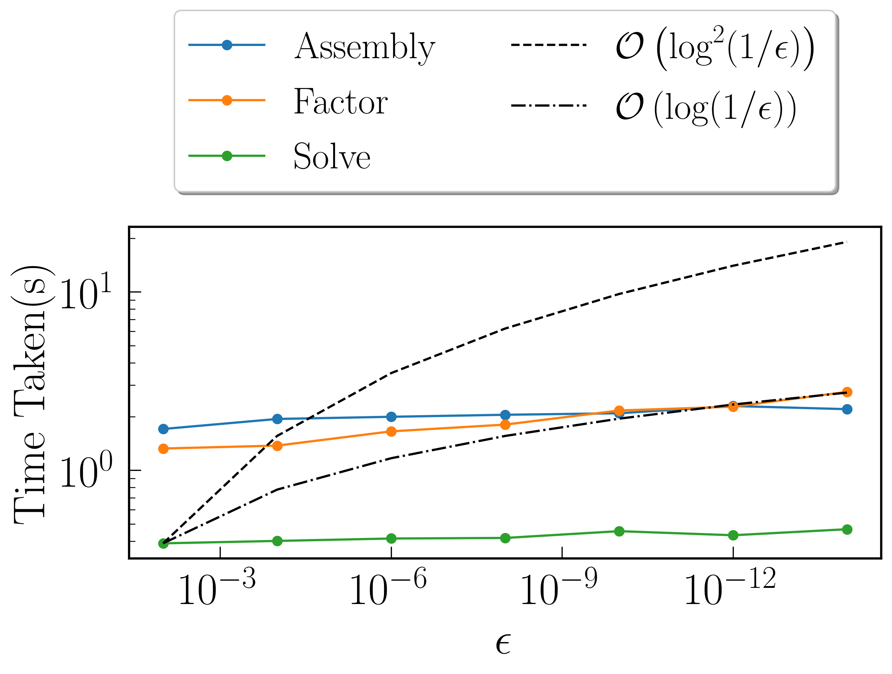

Fast Symmetric Factorization
^^^^^^^^^^^^^^^^^^^^^^^^^^^^

+----------------+------------+---------+------------+--------+--------------+----------------+
|Tolerance       | Assembly(s)|MatVec(s)|Factorize(s)|Solve(s)|Determinant(s)|MultSymFactor(s)|
+================+============+=========+============+========+==============+================+ 
|:math:`10^{-2}` | 1.65146    |13.4722  |0.722689    |0.461396|0.0417881     |0.257583        |
+----------------+------------+---------+------------+--------+--------------+----------------+ 
|:math:`10^{-4}` | 1.87788    |13.6014  |0.778202    |0.471056|0.041806      |0.263908        |
+----------------+------------+---------+------------+--------+--------------+----------------+ 
|:math:`10^{-6}` | 1.93905    |8.81335  |0.836078    |0.478072|0.0427818     |0.268437        |
+----------------+------------+---------+------------+--------+--------------+----------------+ 
|:math:`10^{-8}` | 2.05821    |13.4592  |1.05975     |0.496589|0.0437939     |0.294927        |
+----------------+------------+---------+------------+--------+--------------+----------------+ 
|:math:`10^{-10}`| 2.0032     |14.3409  |1.31922     |0.507549|0.0424139     |0.296023        |
+----------------+------------+---------+------------+--------+--------------+----------------+ 
|:math:`10^{-12}`| 2.23442    |8.84984  |1.51609     |0.533495|0.0427949     |0.311331        |
+----------------+------------+---------+------------+--------+--------------+----------------+ 
|:math:`10^{-14}`| 2.18632    |13.6219  |1.95092     |0.551657|0.0439069     |0.342182        | 
+----------------+------------+---------+------------+--------+--------------+----------------+ 

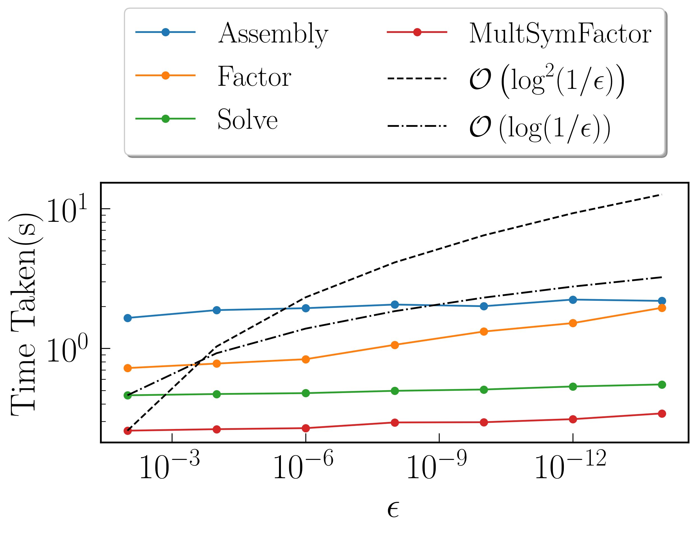

Time Taken vs Size of Matrix
~~~~~~~~~~~~~~~~~~~~~~~~~~~~

For these benchmarks, the leaf size was fixed at :math:`M = 100`, with tolerance set to :math:`10^{-12}`

Fast Factorization
^^^^^^^^^^^^^^^^^^

+-----------------------+------------+---------+------------+--------+--------------+----------------+
|:math:`N`              | Assembly(s)|MatVec(s)|Factorize(s)|Solve(s)|Determinant(s)|Direct LU(s)    |
+=======================+============+=========+============+========+==============+================+
|:math:`10^{3}`         | 0.00927687 |0.0001921|0.0011642   |0.000297|3.19481e-05   |0.0489709       |
+-----------------------+------------+---------+------------+--------+--------------+----------------+
|:math:`5 \times 10^{3}`| 0.0159199  |0.0007879|0.00726509  |0.002069|0.000204086   |2.52755         |
+-----------------------+------------+---------+------------+--------+--------------+----------------+
|:math:`10^{4}`         | 0.026196   |0.0020630|0.0235729   |0.005370|0.000522852   |16.0086         |
+-----------------------+------------+---------+------------+--------+--------------+----------------+
|:math:`5 \times 10^{4}`| 0.098814   |0.0144801|0.106045    |0.027053|0.00375605    |                |
+-----------------------+------------+---------+------------+--------+--------------+----------------+
|:math:`10^{5}`         | 0.180091   |0.0756569|0.19264     |0.054170|0.00687695    |                |
+-----------------------+------------+---------+------------+--------+--------------+----------------+
|:math:`5 \times 10^{5}`| 1.10963    |3.33762  |0.943877    |0.234129|0.0219009     |                |
+-----------------------+------------+---------+------------+--------+--------------+----------------+
|:math:`10^{6}`         | 2.25833    |9.01339  |2.33021     |0.450053|0.041976      |                |
+-----------------------+------------+---------+------------+--------+--------------+----------------+

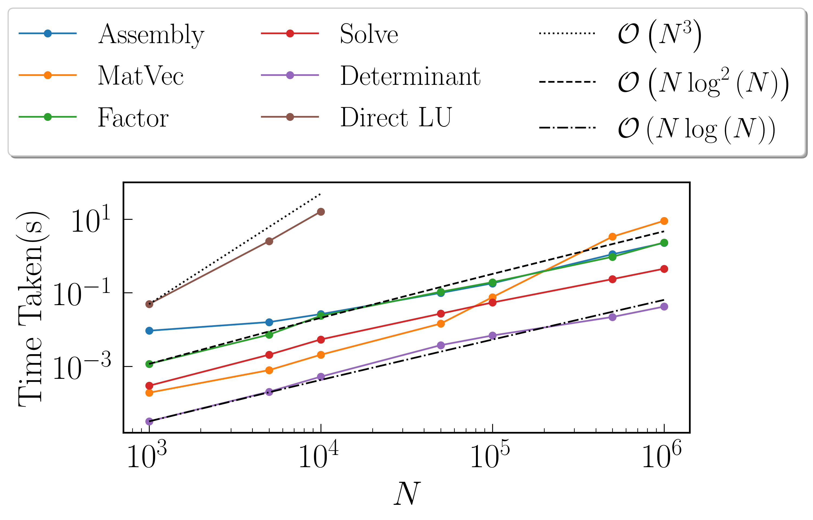

Fast Symmetric Factorization
^^^^^^^^^^^^^^^^^^^^^^^^^^^^

+-----------------------+------------+-----------+------------+----------+--------------+----------------+------------------+
|:math:`N`              | Assembly(s)|MatVec(s)  |Factorize(s)|Solve(s)  |Determinant(s)|MultSymFactor(s)|Direct Cholesky(s)|
+=======================+============+===========+============+==========+==============+================+==================+
|:math:`10^{3}`         | 0.0066328  |0.000208855|0.000833988 |0.00034499|2.81334e-05   |0.000160933     |0.0281229         |
+-----------------------+------------+-----------+------------+----------+--------------+----------------+------------------+
|:math:`5 \times 10^{3}`| 0.0103149  |0.000798941|0.00359011  |0.00228715|0.000156879   |0.00105405      |0.231569          |
+-----------------------+------------+-----------+------------+----------+--------------+----------------+------------------+
|:math:`10^{4}`         | 0.02724    |0.00200987 |0.0175741   |0.00552893|0.000396013   |0.00261402      |1.05882           |
+-----------------------+------------+-----------+------------+----------+--------------+----------------+------------------+
|:math:`5 \times 10^{4}`| 0.08972    |0.0151231  |0.044107    |0.034517  |0.00314713    |0.0162551       |N/A               |
+-----------------------+------------+-----------+------------+----------+--------------+----------------+------------------+
|:math:`10^{5}`         | 0.192696   |0.067266   |0.0933969   |0.0709021 |0.0061872     |0.0332701       |N/A               |
+-----------------------+------------+-----------+------------+----------+--------------+----------------+------------------+
|:math:`5 \times 10^{5}`| 1.09055    |3.2381     |0.612783    |0.263855  |0.024405      |0.151778        |N/A               |
+-----------------------+------------+-----------+------------+----------+--------------+----------------+------------------+
|:math:`10^{6}`         | 2.19711    |8.79683    |1.47177     |0.545244  |0.0434139     |0.310443        |N/A               |
+-----------------------+------------+-----------+------------+----------+--------------+----------------+------------------+

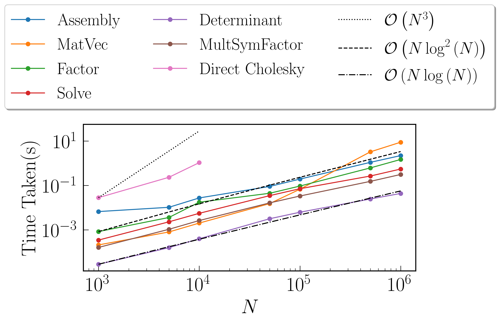

RPY Tensor
##########

The RPY Tensor is given by

.. math::
    K(i, j) = 
    \begin{cases}
        \frac{k_B T}{6 \pi \eta a} \left[\left(1 - \frac{9}{32} \frac{r}{a}\right)\textbf{I} + \frac{3}{32a} \frac{\textbf{r} \otimes \textbf{r}}{r}\right] , & \text{if } r < 2a \\
        \frac{k_B T}{8 \pi \eta r} \left[\textbf{I} + \frac{\textbf{r} \otimes \textbf{r}}{r^2} + \frac{2a^2}{3r^2}\left(\textbf{I} - 3 \frac{\textbf{r} \otimes \textbf{r}}{r^2}\right)\right] , & \text{if } r \geq 2a \\
    \end{cases}

where :math:`r = ||\textbf{r}_i - \textbf{r}_j||` with :math:`\textbf{r}` being set as a sorted random matrix :math:`\in (-1, 1)` with the number of columns set equal to the dimension considered. For these benchmarks, we take :math:`k_B = T = \eta = 1`. For :math:`a`, we find the minimum of the interaction distances between all particles :math:`r_{min}` and set :math:`a = \frac{r_{min}}{2}`. This means that for the considered case, the RPY tensor simplifies to:

.. math::
    K(i, j) = 
    \begin{cases}
        \frac{k_B T}{6 \pi \eta a} \textbf{I} , & \text{if } i = j \\
        \frac{k_B T}{8 \pi \eta r} \left[\textbf{I} + \frac{\textbf{r} \otimes \textbf{r}}{r^2} + \frac{2a^2}{3r^2}\left(\textbf{I} - 3 \frac{\textbf{r} \otimes \textbf{r}}{r^2}\right)\right] , & \text{if } i \neq j \\
    \end{cases}

We have used ``plotTree`` to reveal the rank structure for the problems below when considering matrix size :math:`N = 10000`, leaf size :math:`M = 500` and tolerance :math:`10^{-12}`.

:math:`\texttt{dim} = 1`
~~~~~~~~~~~~~~~~~~~~~~~~

.. image:: images/RPY_rank_structure_dim1.svg
   :width: 400

Time Taken vs Size of Matrix
~~~~~~~~~~~~~~~~~~~~~~~~~~~~

For these benchmarks, the leaf size was fixed at :math:`M = 100`, with tolerance set to :math:`10^{-12}`

Fast Factorization
^^^^^^^^^^^^^^^^^^

+-----------------------+------------+---------+------------+--------+--------------+----------------+
|:math:`N`              | Assembly(s)|MatVec(s)|Factorize(s)|Solve(s)|Determinant(s)|Direct LU(s)    |
+=======================+============+=========+============+========+==============+================+
|:math:`10^{3}`         | 0.0284998  |0.0002059|0.00317788  |0.000329|2.19345e-05   |0.022975        |
+-----------------------+------------+---------+------------+--------+--------------+----------------+
|:math:`5 \times 10^{3}`| 0.124997   |0.0019462|0.028585    |0.003378|0.000226021   |1.57937         |
+-----------------------+------------+---------+------------+--------+--------------+----------------+
|:math:`10^{4}`         | 0.284125   |0.0044059|0.0781479   |0.007328|0.000458002   |11.3985         |
+-----------------------+------------+---------+------------+--------+--------------+----------------+
|:math:`5 \times 10^{4}`| 1.60538    |0.033412 |0.67361     |0.047978|0.001616      |                |
+-----------------------+------------+---------+------------+--------+--------------+----------------+
|:math:`10^{5}`         | 5.49457    |0.145549 |2.47014     |0.254623|0.00333095    |                |
+-----------------------+------------+---------+------------+--------+--------------+----------------+
|:math:`5 \times 10^{5}`| 28.6773    |3.55899  |17.4057     |0.818555|0.0195651     |                |
+-----------------------+------------+---------+------------+--------+--------------+----------------+

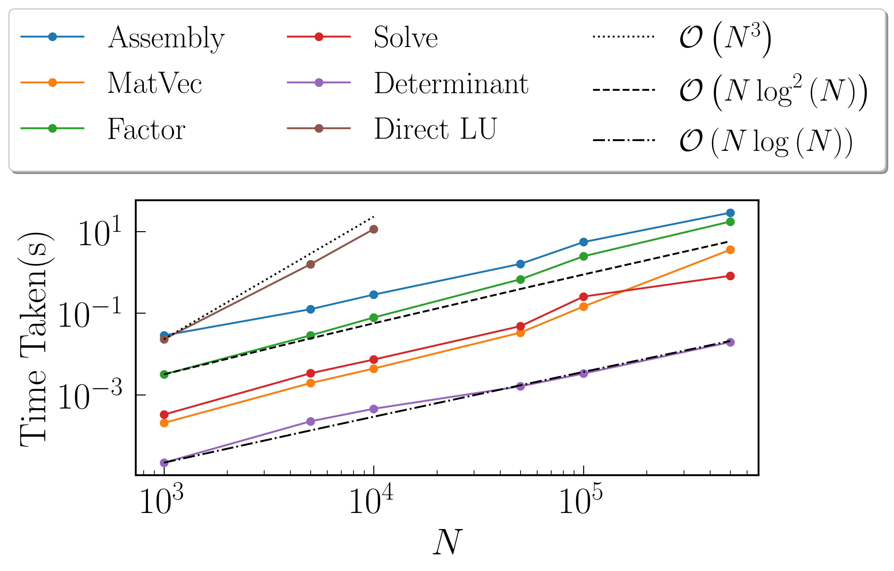

Fast Symmetric Factorization
^^^^^^^^^^^^^^^^^^^^^^^^^^^^

+-----------------------+------------+-----------+------------+----------+--------------+----------------+------------------+
|:math:`N`              | Assembly(s)|MatVec(s)  |Factorize(s)|Solve(s)  |Determinant(s)|MultSymFactor(s)|Direct Cholesky(s)|
+=======================+============+===========+============+==========+==============+================+==================+
|:math:`10^{3}`         | 0.0468209  |0.00031209 |0.008219    |0.00095796|3.19481e-05   |0.0005548       |0.034517          |
+-----------------------+------------+-----------+------------+----------+--------------+----------------+------------------+
|:math:`5 \times 10^{3}`| 0.216226   |0.00294399 |0.042495    |0.00592899|0.000274181   |0.0056932       |3.34734           |
+-----------------------+------------+-----------+------------+----------+--------------+----------------+------------------+
|:math:`10^{4}`         | 0.47921    |0.00559902 |0.10963     |0.0136352 |0.00058794    |0.0109739       |12.3261           |
+-----------------------+------------+-----------+------------+----------+--------------+----------------+------------------+
|:math:`5 \times 10^{4}`| 2.51609    |0.0369091  |0.609879    |0.091403  |0.00190592    |0.069257        |N/A               |
+-----------------------+------------+-----------+------------+----------+--------------+----------------+------------------+
|:math:`10^{5}`         | 5.30011    |0.124498   |1.83744     |0.198894  |0.00388098    |0.161215        |N/A               |
+-----------------------+------------+-----------+------------+----------+--------------+----------------+------------------+
|:math:`5 \times 10^{5}`| 28.9266    |3.54814    |13.6953     |1.03255   |0.0130229     |1.06126         |N/A               |
+-----------------------+------------+-----------+------------+----------+--------------+----------------+------------------+

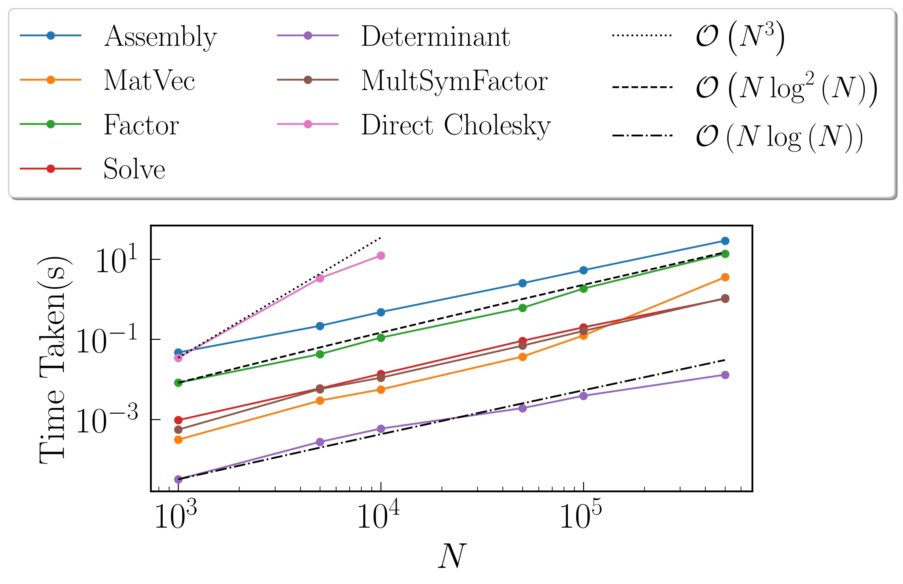

:math:`\texttt{dim} = 2`
~~~~~~~~~~~~~~~~~~~~~~~~

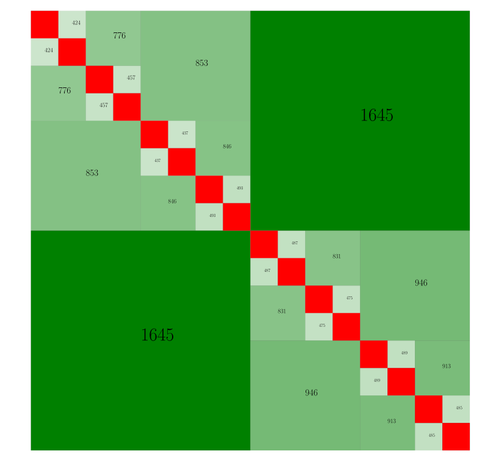

Time Taken vs Size of Matrix
~~~~~~~~~~~~~~~~~~~~~~~~~~~~

For these benchmarks, the leaf size was fixed at :math:`M = 100`, with tolerance set to :math:`10^{-12}`

Fast Factorization
^^^^^^^^^^^^^^^^^^

+-----------------------+------------+---------+------------+--------+--------------+----------------+
|:math:`N`              | Assembly(s)|MatVec(s)|Factorize(s)|Solve(s)|Determinant(s)|Direct LU(s)    |
+=======================+============+=========+============+========+==============+================+
|:math:`10^{3}`         | 0.237684   |0.0022819|0.161561    |0.003957|0.000130177   |0.0220509       |
+-----------------------+------------+---------+------------+--------+--------------+----------------+
|:math:`2 \times 10^{3}`| 0.854779   |0.0138352|0.728164    |0.013024|0.000378847   |0.148836        |
+-----------------------+------------+---------+------------+--------+--------------+----------------+
|:math:`4 \times 10^{3}`| 3.31121    |0.0200999|2.52401     |0.037282|0.000866175   |0.88069         |
+-----------------------+------------+---------+------------+--------+--------------+----------------+
|:math:`8 \times 10^{3}`| 15.0432    |0.0863769|10.1511     |0.120667|0.00184798    |6.3137          |
+-----------------------+------------+---------+------------+--------+--------------+----------------+
|:math:`1.6\times10^{4}`| 63.8282    |0.278127 |53.9138     |0.46551 |0.0048461     |55.4166         |
+-----------------------+------------+---------+------------+--------+--------------+----------------+

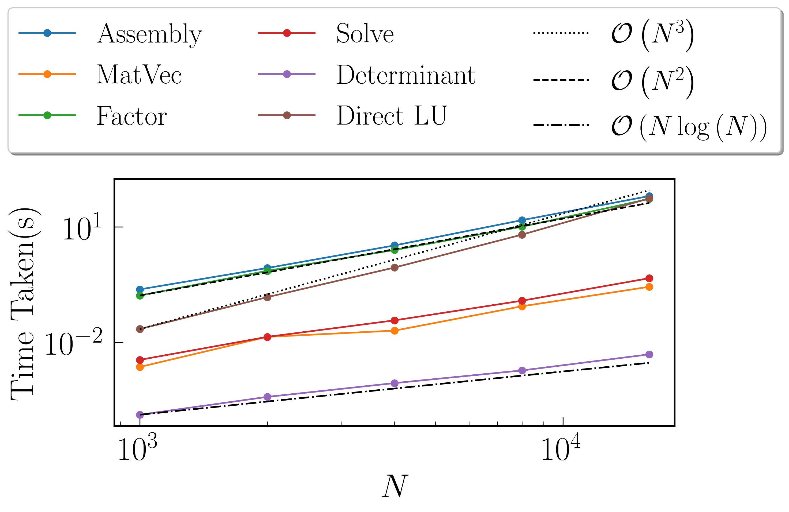

Fast Symmetric Factorization
^^^^^^^^^^^^^^^^^^^^^^^^^^^^

+-----------------------+------------+-----------+------------+----------+--------------+----------------+------------------+
|:math:`N`              | Assembly(s)|MatVec(s)  |Factorize(s)|Solve(s)  |Determinant(s)|MultSymFactor(s)|Direct Cholesky(s)|
+=======================+============+===========+============+==========+==============+================+==================+
|:math:`10^{3}`         | 0.375776   |0.00342607 |0.24704     |0.00635099|0.000114918   |0.0118291       |0.026149          |
+-----------------------+------------+-----------+------------+----------+--------------+----------------+------------------+
|:math:`2 \times 10^{3}`| 1.35015    |0.00995803 |1.05952     |0.0212729 |0.000280142   |0.0441241       |0.130154          |
+-----------------------+------------+-----------+------------+----------+--------------+----------------+------------------+
|:math:`4 \times 10^{3}`| 4.89776    |0.0418921  |4.12168     |0.107635  |0.000642061   |0.142907        |1.49561           |
+-----------------------+------------+-----------+------------+----------+--------------+----------------+------------------+
|:math:`8 \times 10^{3}`| 19.4326    |0.0971079  |16.3962     |0.201411  |0.00139117    |0.547673        |6.13806           |
+-----------------------+------------+-----------+------------+----------+--------------+----------------+------------------+
|:math:`1.6\times10^{4}`| 79.2166    |0.539779   |66.3061     |0.716309  |0.00301003    |2.18507         |52.0411           |
+-----------------------+------------+-----------+------------+----------+--------------+----------------+------------------+

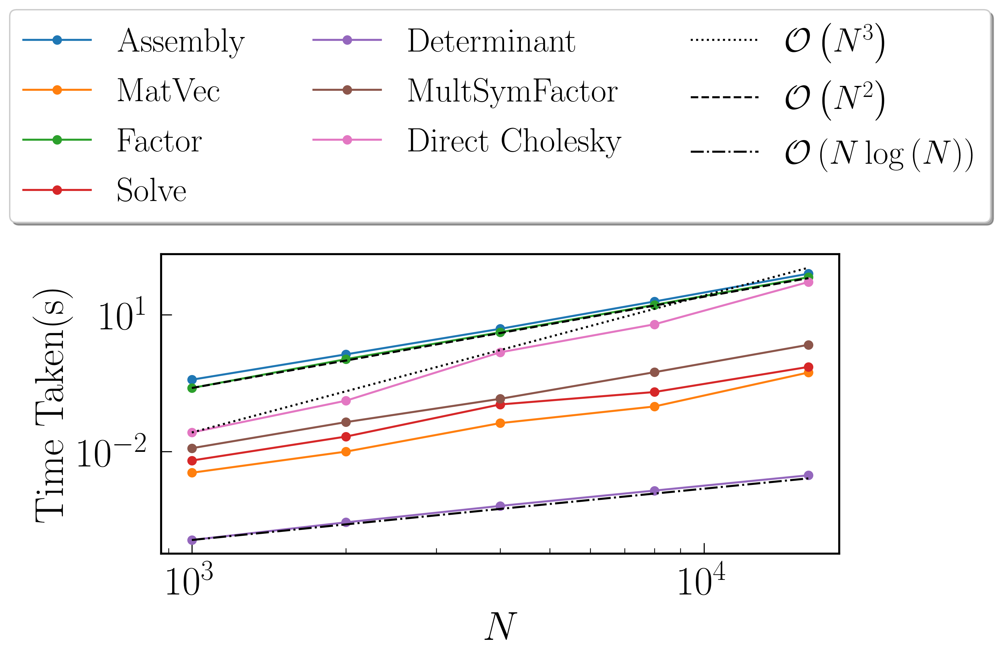

:math:`\texttt{dim} = 3`
~~~~~~~~~~~~~~~~~~~~~~~~

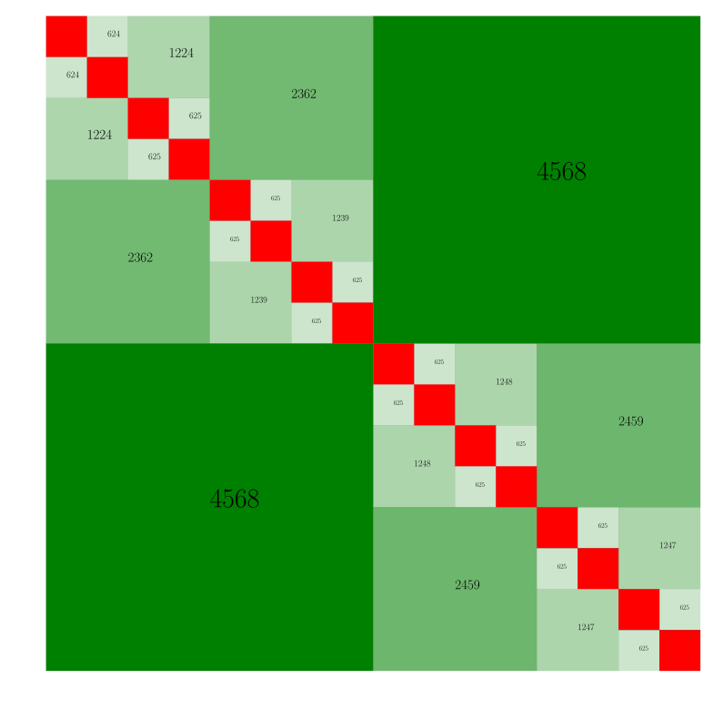

For these benchmarks, the leaf size was fixed at :math:`M = 100`, with tolerance set to :math:`10^{-12}`

Fast Factorization
^^^^^^^^^^^^^^^^^^

+-----------------------+------------+---------+------------+--------+--------------+----------------+
|:math:`N`              | Assembly(s)|MatVec(s)|Factorize(s)|Solve(s)|Determinant(s)|Direct LU(s)    |
+=======================+============+=========+============+========+==============+================+
|:math:`999`            | 0.637549   |0.0138719|0.357686    |0.006175|0.000198841   |0.0427179       |
+-----------------------+------------+---------+------------+--------+--------------+----------------+
|:math:`2 \times 999`   | 2.67525    |0.0112109|1.915       |0.026588|0.000624895   |0.209663        |
+-----------------------+------------+---------+------------+--------+--------------+----------------+
|:math:`3 \times 999`   | 7.72688    |0.0243111|5.49087     |0.056867|0.000961065   |0.608226        |
+-----------------------+------------+---------+------------+--------+--------------+----------------+
|:math:`4 \times 999`   | 16.6299    |0.0466208|12.8754     |0.105617|0.00150394    |1.26595         |
+-----------------------+------------+---------+------------+--------+--------------+----------------+
|:math:`5 \times 999`   | 31.9858    |0.078845 |24.7647     |0.169478|0.00192094    |2.26981         |
+-----------------------+------------+---------+------------+--------+--------------+----------------+
|:math:`6 \times 999`   | 48.5977    |0.114865 |41.1307     |0.241243|0.00212693    |3.69254         |
+-----------------------+------------+---------+------------+--------+--------------+----------------+
|:math:`7 \times 999`   | 76.1404    |0.159873 |64.5563     |0.32299 |0.00276279    |5.80262         |
+-----------------------+------------+---------+------------+--------+--------------+----------------+
|:math:`8 \times 999`   | 105.803    |0.238746 |91.5038     |0.405407|0.00317407    |8.46848         |
+-----------------------+------------+---------+------------+--------+--------------+----------------+

Fast Symmetric Factorization
^^^^^^^^^^^^^^^^^^^^^^^^^^^^

+--------------------+------------+-----------+------------+----------+--------------+----------------+------------------+
|:math:`N`           | Assembly(s)|MatVec(s)  |Factorize(s)|Solve(s)  |Determinant(s)|MultSymFactor(s)|Direct Cholesky(s)|
+====================+============+===========+============+==========+==============+================+==================+
|:math:`999`         | 0.60924    |0.00287509 |0.303544    |0.00726318|0.000123978   |0.012032        |0.046663          |
+--------------------+------------+-----------+------------+----------+--------------+----------------+------------------+
|:math:`2 \times 999`| 2.88964    |0.0122139  |1.91556     |0.0310731 |0.000324965   |0.107921        |0.294039          |
+--------------------+------------+-----------+------------+----------+--------------+----------------+------------------+
|:math:`3 \times 999`| 8.15757    |0.029355   |5.2501      |0.079915  |0.000537872   |0.291421        |0.848032          |
+--------------------+------------+-----------+------------+----------+--------------+----------------+------------------+
|:math:`4 \times 999`| 17.7442    |0.055275   |12.4843     |0.159855  |0.000857115   |0.527207        |1.91446           |
+--------------------+------------+-----------+------------+----------+--------------+----------------+------------------+
|:math:`5 \times 999`| 33.741     |0.08866    |23.0541     |0.211891  |0.000997066   |0.891842        |3.62749           |
+--------------------+------------+-----------+------------+----------+--------------+----------------+------------------+
|:math:`6 \times 999`| 50.7127    |0.150594   |39.2222     |0.302245  |0.00147223    |1.60647         |6.26212           |
+--------------------+------------+-----------+------------+----------+--------------+----------------+------------------+
|:math:`7 \times 999`| 77.2103    |0.175368   |60.007      |0.388988  |0.00160313    |2.15237         |9.70271           |
+--------------------+------------+-----------+------------+----------+--------------+----------------+------------------+
|:math:`8 \times 999`| 103.913    |0.232704   |82.881      |0.490437  |0.00186086    |2.67931         |14.0804           |
+--------------------+------------+-----------+------------+----------+--------------+----------------+------------------+
