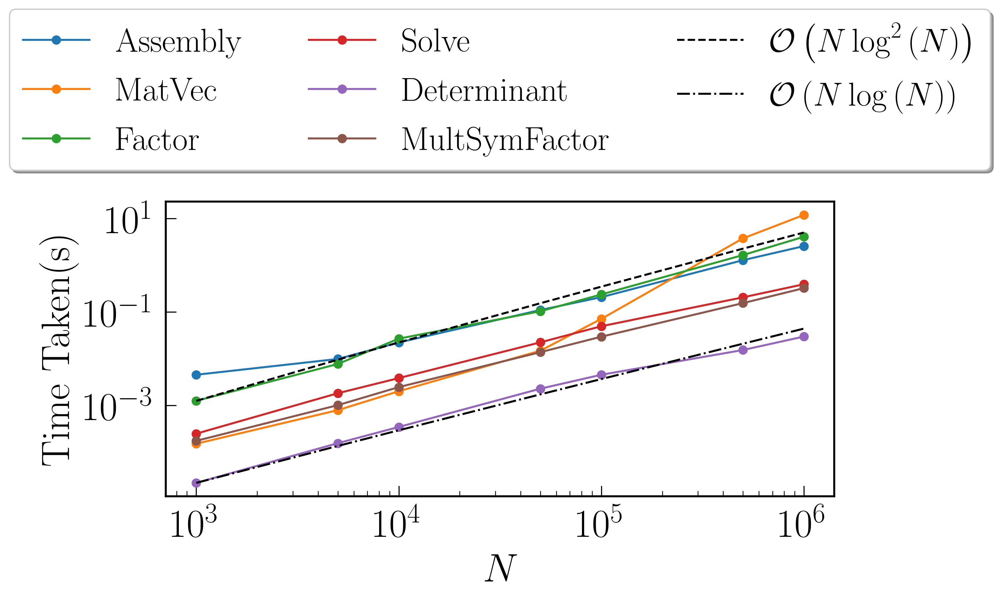

**********
Benchmarks
**********

All the following benchmarks have been carried out on an i7-8750H(with OpenMP enabled, this is 12 threads), with Intel's icpc (ICC) 19.0.1.144 compiler and Eigen version 3.3.7. The compiler flags that were utilized are the same are those mentioned in the ``CMakeLists.txt`` file.

Presented below are the results as obtained when using different kernels:

Gaussian Kernel
---------------

The Gaussian Kernel is given by :math:`K(i, j) = \sigma^2 \delta_{ij}^2 + \exp(-||x_i - x_j||^2)`. For these benchmarks, we take :math:`\sigma = 10` with :math:`x` being set as a sorted random vector. Using the ``plotTree`` function of this library, we can look at the rank structure for this matrix. The following diagram is obtained with :math:`N = 10000`, :math:`M = 500` and tolerance :math:`10^{-12}`

.. image:: images/gaussian_rank_structure.svg
   :width: 600

The green blocks are low-rank blocks. Their intensity of color shows their degree of "low-rankedness". Additionally, the rank has been displayed in each of these blocks. The red blocks are full-rank blocks and would have the rank of :math:`M = 500`

Time Taken vs Tolerance
~~~~~~~~~~~~~~~~~~~~~~~

For these benchmarks the size of the matrix :math:`N = 1000000`, with the size of the leaf node set to :math:`M = 100`.

Fast Factorization
^^^^^^^^^^^^^^^^^^

+----------------+------------+---------+------------+--------+--------------+
|Tolerance       | Assembly(s)|MatVec(s)|Factorize(s)|Solve(s)|Determinant(s)|
+================+============+=========+============+========+==============+ 
|:math:`10^{-2}` | 1.61535    |11.2231  |1.43992     |0.325999|0.0307682     |
+----------------+------------+---------+------------+--------+--------------+ 
|:math:`10^{-4}` | 1.83888    |8.31404  |2.01543     |0.336854|0.029964      |
+----------------+------------+---------+------------+--------+--------------+ 
|:math:`10^{-6}` | 1.92416    |12.0651  |2.43385     |0.348453|0.0303309     |
+----------------+------------+---------+------------+--------+--------------+
|:math:`10^{-8}` | 2.10391    |11.999   |2.82031     |0.367261|0.0307109     |
+----------------+------------+---------+------------+--------+--------------+ 
|:math:`10^{-10}`| 2.24935    |12.159   |3.28602     |0.383749|0.030468      |
+----------------+------------+---------+------------+--------+--------------+ 
|:math:`10^{-12}`| 2.61172    |12.0026  |3.97983     |0.393385|0.030926      |
+----------------+------------+---------+------------+--------+--------------+ 
|:math:`10^{-14}`| 2.91879    |7.75926  |4.91985     |0.427968|0.0306408     | 
+----------------+------------+---------+------------+--------+--------------+ 

Fast Symmetric Factorization
^^^^^^^^^^^^^^^^^^^^^^^^^^^^

+----------------+------------+---------+------------+--------+--------------+----------------+
|Tolerance       | Assembly(s)|MatVec(s)|Factorize(s)|Solve(s)|Determinant(s)|MultSymFactor(s)|
+================+============+=========+============+========+==============+================+ 
|:math:`10^{-2}` | 1.61535    |11.2231  |1.43992     |0.325999|0.0307682     |0.291572        |
+----------------+------------+---------+------------+--------+--------------+----------------+ 
|:math:`10^{-4}` | 1.83888    |8.31404  |2.01543     |0.336854|0.029964      |0.320466        |
+----------------+------------+---------+------------+--------+--------------+----------------+ 
|:math:`10^{-6}` | 1.92416    |12.0651  |2.43385     |0.348453|0.0303309     |0.346802        |
+----------------+------------+---------+------------+--------+--------------+----------------+ 
|:math:`10^{-8}` | 2.10391    |11.999   |2.82031     |0.367261|0.0307109     |0.373686        |
+----------------+------------+---------+------------+--------+--------------+----------------+ 
|:math:`10^{-10}`| 2.24935    |12.159   |3.28602     |0.383749|0.030468      |0.407168        |
+----------------+------------+---------+------------+--------+--------------+----------------+ 
|:math:`10^{-12}`| 2.61172    |12.0026  |3.97983     |0.393385|0.030926      |0.450933        |
+----------------+------------+---------+------------+--------+--------------+----------------+ 
|:math:`10^{-14}`| 2.91879    |7.75926  |4.91985     |0.427968|0.0306408     |0.500006        | 
+----------------+------------+---------+------------+--------+--------------+----------------+ 

Time Taken vs Size of Matrix
~~~~~~~~~~~~~~~~~~~~~~~~~~~~

For these benchmarks, the leaf size was fixed at :math:`M = 100`, with tolerance set to :math:`10^{-12}`

Fast Factorization
^^^^^^^^^^^^^^^^^^

+-----------------------+------------+------------+------------+-----------+--------------+----------------+
|:math:`N`              | Assembly(s)|MatVec(s)   |Factorize(s)|Solve(s)   |Determinant(s)|Direct LU(s)    |
+=======================+============+============+============+===========+==============+================+
|:math:`10^{3}`         | 0.00345016 |0.000463963 |0.00121403  |0.000246048|2.09808e-05   |0.024302        |
+-----------------------+------------+------------+------------+-----------+--------------+----------------+
|:math:`5 \times 10^{3}`| 0.00954294 |0.000818014 |0.00755906  |0.00179601 |0.000159979   |1.61282         |
+-----------------------+------------+------------+------------+-----------+--------------+----------------+
|:math:`10^{4}`         | 0.0180159  |0.00202203  |0.103507    |0.0224481  |0.00233793    |10.4102         |
+-----------------------+------------+------------+------------+-----------+--------------+----------------+
|:math:`5 \times 10^{4}`| 0.109816   |0.0147851   |0.103266    |0.022316   |0.00227404    |N/A             |
+-----------------------+------------+------------+------------+-----------+--------------+----------------+
|:math:`10^{5}`         | 0.202525   |0.066885    |0.239639    |0.0450559  |0.00451112    |N/A             |
+-----------------------+------------+------------+------------+-----------+--------------+----------------+
|:math:`5 \times 10^{5}`| 1.19365    |3.68382     |1.6615      |0.206754   |0.015748      |N/A             |
+-----------------------+------------+------------+------------+-----------+--------------+----------------+
|:math:`10^{6}`         | 2.53519    |11.1435     |3.93549     |0.399695   |0.0303771     |N/A             |
+-----------------------+------------+------------+------------+-----------+--------------+----------------+

Fast Symmetric Factorization
^^^^^^^^^^^^^^^^^^^^^^^^^^^^

+-----------------------+------------+-----------+------------+----------+--------------+----------------+------------------+
|:math:`N`              | Assembly(s)|MatVec(s)  |Factorize(s)|Solve(s)  |Determinant(s)|MultSymFactor(s)|Direct Cholesky(s)|
+=======================+============+===========+============+==========+==============+================+==================+
|:math:`10^{3}`         | 0.00344396 |0.000510931|0.00103807  |0.00030303|2.19345e-05   |0.000180006     |0.0316679         |
+-----------------------+------------+-----------+------------+----------+--------------+----------------+------------------+
|:math:`5 \times 10^{3}`| 0.00925708 |0.000812054|0.00626493  |0.00209403|0.000108004   |0.00113392      |2.35399           |
+-----------------------+------------+-----------+------------+----------+--------------+----------------+------------------+
|:math:`10^{4}`         | 0.0183232  |0.00199389 |0.010865    |0.00471711|0.000352859   |0.00263691      |18.5745           |
+-----------------------+------------+-----------+------------+----------+--------------+----------------+------------------+
|:math:`5 \times 10^{4}`| 0.0946209  |0.0151899  |0.0787759   |0.0285201 |0.00230503    |0.0157571       |N/A               |
+-----------------------+------------+-----------+------------+----------+--------------+----------------+------------------+
|:math:`10^{5}`         | 0.203769   |0.0659761  |0.183974    |0.058074  |0.00438595    |0.03263         |N/A               |
+-----------------------+------------+-----------+------------+----------+--------------+----------------+------------------+
|:math:`5 \times 10^{5}`| 1.18639    |3.67825    |1.47418     |0.245743  |0.0180571     |0.162066        |N/A               |
+-----------------------+------------+-----------+------------+----------+--------------+----------------+------------------+
|:math:`10^{6}`         | 2.53567    |11.2973    |3.56786     |0.488049  |0.0311899     |0.377352        |N/A               |
+-----------------------+------------+-----------+------------+----------+--------------+----------------+------------------+

Matérn Kernel
-------------

Kernel considered is given by :math:`K(r) = \sigma^2 \left(1 + \frac{r \sqrt{5}}{\rho} + \frac{5 r^2}{3 \rho^2}\right)\exp{\left(-\frac{r \sqrt{5}}{\rho}\right)}`. For these benchmarks, we take :math:`\sigma = 10`, where :math:`r = ||x_i - x_j||` with :math:`x` being set as a sorted random vector. Using ``plotTree`` for :math:`N = 10000`, :math:`M = 500` and tolerance :math:`10^{-12}`, we get this rank structure

.. image:: images/matern_rank_structure.svg
   :width: 600

Time Taken vs Tolerance
~~~~~~~~~~~~~~~~~~~~~~~

For these benchmarks the size of the matrix :math:`N = 1000000`, with the size of the leaf node set to :math:`M = 100`.

Fast Factorization
^^^^^^^^^^^^^^^^^^

+----------------+------------+---------+------------+--------+--------------+
|Tolerance       | Assembly(s)|MatVec(s)|Factorize(s)|Solve(s)|Determinant(s)|
+================+============+=========+============+========+==============+ 
|:math:`10^{-2}` | 1.61535    |11.2231  |1.43992     |0.325999|0.0307682     |
+----------------+------------+---------+------------+--------+--------------+ 
|:math:`10^{-4}` | 1.83888    |8.31404  |2.01543     |0.336854|0.029964      |
+----------------+------------+---------+------------+--------+--------------+ 
|:math:`10^{-6}` | 1.92416    |12.0651  |2.43385     |0.348453|0.0303309     |
+----------------+------------+---------+------------+--------+--------------+
|:math:`10^{-8}` | 2.10391    |11.999   |2.82031     |0.367261|0.0307109     |
+----------------+------------+---------+------------+--------+--------------+ 
|:math:`10^{-10}`| 2.24935    |12.159   |3.28602     |0.383749|0.030468      |
+----------------+------------+---------+------------+--------+--------------+ 
|:math:`10^{-12}`| 2.61172    |12.0026  |3.97983     |0.393385|0.030926      |
+----------------+------------+---------+------------+--------+--------------+ 
|:math:`10^{-14}`| 2.91879    |7.75926  |4.91985     |0.427968|0.0306408     | 
+----------------+------------+---------+------------+--------+--------------+ 

Fast Symmetric Factorization
^^^^^^^^^^^^^^^^^^^^^^^^^^^^

+----------------+------------+---------+------------+--------+--------------+----------------+
|Tolerance       | Assembly(s)|MatVec(s)|Factorize(s)|Solve(s)|Determinant(s)|MultSymFactor(s)|
+================+============+=========+============+========+==============+================+ 
|:math:`10^{-2}` | 1.61535    |11.2231  |1.43992     |0.325999|0.0307682     |0.291572        |
+----------------+------------+---------+------------+--------+--------------+----------------+ 
|:math:`10^{-4}` | 1.83888    |8.31404  |2.01543     |0.336854|0.029964      |0.320466        |
+----------------+------------+---------+------------+--------+--------------+----------------+ 
|:math:`10^{-6}` | 1.92416    |12.0651  |2.43385     |0.348453|0.0303309     |0.346802        |
+----------------+------------+---------+------------+--------+--------------+----------------+ 
|:math:`10^{-8}` | 2.10391    |11.999   |2.82031     |0.367261|0.0307109     |0.373686        |
+----------------+------------+---------+------------+--------+--------------+----------------+ 
|:math:`10^{-10}`| 2.24935    |12.159   |3.28602     |0.383749|0.030468      |0.407168        |
+----------------+------------+---------+------------+--------+--------------+----------------+ 
|:math:`10^{-12}`| 2.61172    |12.0026  |3.97983     |0.393385|0.030926      |0.450933        |
+----------------+------------+---------+------------+--------+--------------+----------------+ 
|:math:`10^{-14}`| 2.91879    |7.75926  |4.91985     |0.427968|0.0306408     |0.500006        | 
+----------------+------------+---------+------------+--------+--------------+----------------+ 

Time Taken vs Size of Matrix
~~~~~~~~~~~~~~~~~~~~~~~~~~~~

For these benchmarks, the leaf size was fixed at :math:`M = 100`, with tolerance set to :math:`10^{-12}`

Fast Factorization
^^^^^^^^^^^^^^^^^^

+-----------------------+------------+---------+------------+--------+--------------+
|:math:`N`              | Assembly(s)|MatVec(s)|Factorize(s)|Solve(s)|Determinant(s)|
+=======================+============+=========+============+========+==============+
|:math:`10^{3}`         | 0.00452018 |0.0001511|0.00124907  |0.000248|2.19345e-05   |
+-----------------------+------------+---------+------------+--------+--------------+
|:math:`5 \times 10^{3}`| 0.00984001 |0.0007910|0.0076859   |0.001818|0.000154972   |
+-----------------------+------------+---------+------------+--------+--------------+
|:math:`10^{4}`         | 0.0221798  |0.0020070|0.0267668   |0.003834|0.000344992   |
+-----------------------+------------+---------+------------+--------+--------------+
|:math:`5 \times 10^{4}`| 0.109816   |0.0147851|0.103266    |0.022316|0.00227404    |
+-----------------------+------------+---------+------------+--------+--------------+
|:math:`10^{5}`         | 0.206706   |0.070899 |0.236457    |0.049373|0.00451994    |
+-----------------------+------------+---------+------------+--------+--------------+
|:math:`5 \times 10^{5}`| 1.2777     |3.73952  |1.64487     |0.204942|0.0152869     |
+-----------------------+------------+---------+------------+--------+--------------+
|:math:`10^{6}`         | 2.55621    |11.8861  |4.05243     |0.39081 |0.0296741     |
+-----------------------+------------+---------+------------+--------+--------------+

Fast Symmetric Factorization
^^^^^^^^^^^^^^^^^^^^^^^^^^^^

+-----------------------+------------+---------+------------+--------+--------------+----------------+
|:math:`N`              | Assembly(s)|MatVec(s)|Factorize(s)|Solve(s)|Determinant(s)|MultSymFactor(s)|
+=======================+============+=========+============+========+==============+================+
|:math:`10^{3}`         | 0.00452018 |0.0001511|0.00124907  |0.000248|2.19345e-05   |0.000174046     |
+-----------------------+------------+---------+------------+--------+--------------+----------------+
|:math:`5 \times 10^{3}`| 0.00984001 |0.0007910|0.0076859   |0.001818|0.000154972   |0.00101018      |
+-----------------------+------------+---------+------------+--------+--------------+----------------+
|:math:`10^{4}`         | 0.0221798  |0.0020070|0.0267668   |0.003834|0.000344992   |0.00245905      |
+-----------------------+------------+---------+------------+--------+--------------+----------------+
|:math:`5 \times 10^{4}`| 0.109816   |0.0147851|0.103266    |0.022316|0.00227404    |0.0137429       |
+-----------------------+------------+---------+------------+--------+--------------+----------------+
|:math:`10^{5}`         | 0.206706   |0.070899 |0.236457    |0.049373|0.00451994    |0.029464        |
+-----------------------+------------+---------+------------+--------+--------------+----------------+
|:math:`5 \times 10^{5}`| 1.2777     |3.73952  |1.64487     |0.204942|0.0152869     |0.154164        |
+-----------------------+------------+---------+------------+--------+--------------+----------------+
|:math:`10^{6}`         | 2.55621    |11.8861  |4.05243     |0.39081 |0.0296741     |0.322262        |
+-----------------------+------------+---------+------------+--------+--------------+----------------+

