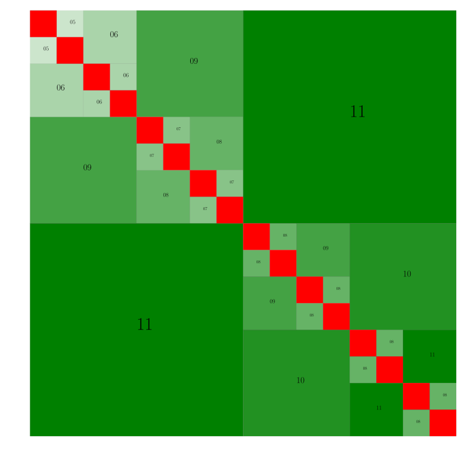
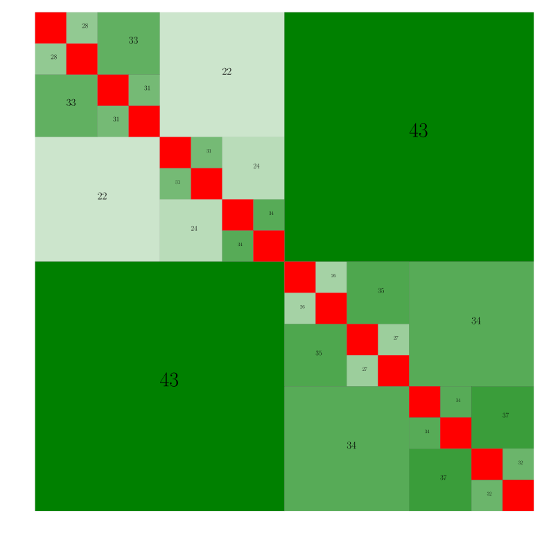

********
Tutorial
********

For the sake of this tutorial, we are going to be using the ``tutorial.cpp`` file that is listed under ``examples/`` since it demonstrates all the features of this library. For the most part, comments in the file demonstrate intended functionality. However, we go over the main functions that may be of interest to a user on this page. 

**NOTE**: It is assumed that you have already completed the installation process of getting the dependencies.

Setting Parameters in CMakeLists.txt
------------------------------------

There are some variables that need to be set by the user at the top of the ``CMakeLists.txt`` file:

- ``INPUT_FILE``: This is the input ``.cpp`` file that needs to be compiled. For this tutorial, it's going to be set to ``examples/tutorial.cpp``.
- ``OUTPUT_EXECUTABLE``: This is the name that the final build executable is given. Here we are just going to set is as ``tutorial``.
- ``DTYPE``: Datatype that is used in all the computations. Can be set to ``float``, ``double``, ``complex32`` and ``complex64``. We are going to be using ``double`` for this tutorial.

Creating a Derived Class of ``HODLR_Matrix``:
---------------------------------------------

The matrix that needs to be solved for is abstracted through this derived class of ``HODLR_Matrix``. For the sake of the tutorial, we are calling this derived class ``Kernel``. The main method that needs to be set for this class is ``getMatrixEntry`` which returns the entry at the :math:`i^{\mathrm{th}}` row and :math:`j^{\mathrm{th}}` column of the matrix. For instance, for the Hilbert matrix of size :math:`N \times N`, this would be set as::

    class Kernel : public HODLR_Matrix 
    {
        public:

            Kernel(int N) : HODLR_Matrix(N){}

            dtype getMatrixEntry(int i, int j) 
            {
                return (1. / (i + j + 1));
            }
    }

Note that here ``dtype`` is set during compilation depending on ``DTYPE`` that was set in ``CMakeLists.txt``.

In this tutorial, we have initialized a random set of points in :math:`(-1, 1)` which are then sorted to obtain a coordinate vector :math:`x`. Using this, we compute the distance between the :math:`i^{\mathrm{th}}` point and :math:`j^{\mathrm{th}}` in :math:`x` to obtain :math:`R` which can then be used in different kernel functions::

    class Kernel : public HODLR_Matrix 
    {

        private:
            Mat x;

        public:

            // Constructor:
            Kernel(int N, int dim) : HODLR_Matrix(N) 
            {
                // Getting the random distribution of points:
                x = (Mat::Random(N, dim)).real();
                // This is being sorted to ensure that we get optimal low rank structure:
                getKDTreeSorted(x, 0);
            };
        
            // In this example, we are illustrating usage of the gaussian kernel:
            dtype getMatrixEntry(int i, int j) 
            {
                size_t dim = x.cols();

                // Value on the diagonal:
                if(i == j)
                {
                    return 10;
                }
                
                // Otherwise:
                else
                {   
                    dtype R2 = 0;

                    for(int k = 0; k < dim; k++) 
                    {
                        R2 += (x(i,k) - x(j,k)) * (x(i,k) - x(j,k));
                    }

                    return exp(-R2);
                }
            }
    }

Creating the Instance of ``HODLR_Tree``:
----------------------------------------

The main operations of this library are carried out through the ``HODLR_Tree`` class. The parameters that are taken for the constructor are the number of levels, tolerance for approximation and the earlier created instance of ``Kernel``::
    
    Kernel* K     = new Kernel(N, dim);
    HODLR_Tree* T = new HODLR_Tree(n_levels, tolerance, K);

We will now proceed to demonstrate the individual methods available under this class.

``assembleTree``
^^^^^^^^^^^^^^^^

We proceed to call the ``assembleTree`` method. This obtains the complete matrix for the leaf levels and the low-rank approximation for the off-diagonal blocks. Here we have used mentioned the fact that the matrix that we are constructing is both symmetric and positive-definite. Note that when we mention that the matrix is symmetric and positive-definite, the fast symmetric factorization method would be used. In all other cases the fast factorization method gets used::

    bool is_sym = true;
    bool is_pd = true;
    T->assembleTree(is_sym, is_pd);

``plotTree``
^^^^^^^^^^^^

This function is used to visualize the rank structure of the matrix encoded through the defined ``Kernel`` object. It's useful to build a visual understanding of the "low-rankness" of the sub-blocks of the matrix::

    T->symmetricFactorProduct(x);

For instance, with the gaussian kernel with :math:`N = 1000`, :math:`M = 100` and tolerance :math:`\epsilon = 10^{-12}`, we obtain this image:

If consider the RPY Tensor of :math:`\texttt{dim} = 1` for the same parameters, we get this image:

It is easy to see that the gaussian kernel shows a much "stronger" low rank nature than the RPY tensor.

``printTreeDetails``
^^^^^^^^^^^^^^^^^^^^

This is a function which is mainly used in the process of development to understand how the nodes are being assigned in the tree. It is a great utility function to understand all the details of the nodes in the tree. For instance, the gaussian kernel when using :math:`N = 1000`, :math:`M = 100` and tolerance :math:`\epsilon = 10^{-12}` gives this output::

    Level Number       :0
    Node Number        :0
    Start of Node      :0
    Size of Node       :1000
    Tolerance          :1e-12
    Left Child:
    Start of Child Node:0
    Size of Child Node :500
    Right Child:
    Start of Child Node:500
    Size of Child Node :500
    Shape of U[0]      :500, 11
    Shape of U[1]      :500, 11
    Shape of V[0]      :500, 11
    Shape of V[1]      :500, 11
    Shape of K         :0, 0
    =======================================================================================================================================

    Level Number       :1
    Node Number        :0
    Start of Node      :0
    Size of Node       :500
    Tolerance          :1e-12
    Left Child:
    Start of Child Node:0
    Size of Child Node :250
    Right Child:
    Start of Child Node:250
    Size of Child Node :250
    Shape of U[0]      :250, 8
    Shape of U[1]      :250, 8
    Shape of V[0]      :250, 8
    Shape of V[1]      :250, 8
    Shape of K         :0, 0
    =======================================================================================================================================
    Level Number       :1
    Node Number        :1
    Start of Node      :500
    Size of Node       :500
    Tolerance          :1e-12
    Left Child:
    Start of Child Node:500
    Size of Child Node :250
    Right Child:
    Start of Child Node:750
    Size of Child Node :250
    Shape of U[0]      :250, 10
    Shape of U[1]      :250, 10
    Shape of V[0]      :250, 10
    Shape of V[1]      :250, 10
    Shape of K         :0, 0
    =======================================================================================================================================

    Level Number       :2
    Node Number        :0
    Start of Node      :0
    Size of Node       :250
    Tolerance          :1e-12
    Left Child:
    Start of Child Node:0
    Size of Child Node :125
    Right Child:
    Start of Child Node:125
    Size of Child Node :125
    Shape of U[0]      :125, 6
    Shape of U[1]      :125, 6
    Shape of V[0]      :125, 6
    Shape of V[1]      :125, 6
    Shape of K         :0, 0
    =======================================================================================================================================
    Level Number       :2
    Node Number        :1
    Start of Node      :250
    Size of Node       :250
    Tolerance          :1e-12
    Left Child:
    Start of Child Node:250
    Size of Child Node :125
    Right Child:
    Start of Child Node:375
    Size of Child Node :125
    Shape of U[0]      :125, 8
    Shape of U[1]      :125, 8
    Shape of V[0]      :125, 8
    Shape of V[1]      :125, 8
    Shape of K         :0, 0
    =======================================================================================================================================
    Level Number       :2
    Node Number        :2
    Start of Node      :500
    Size of Node       :250
    Tolerance          :1e-12
    Left Child:
    Start of Child Node:500
    Size of Child Node :125
    Right Child:
    Start of Child Node:625
    Size of Child Node :125
    Shape of U[0]      :125, 8
    Shape of U[1]      :125, 8
    Shape of V[0]      :125, 8
    Shape of V[1]      :125, 8
    Shape of K         :0, 0
    =======================================================================================================================================
    Level Number       :2
    Node Number        :3
    Start of Node      :750
    Size of Node       :250
    Tolerance          :1e-12
    Left Child:
    Start of Child Node:750
    Size of Child Node :125
    Right Child:
    Start of Child Node:875
    Size of Child Node :125
    Shape of U[0]      :125, 9
    Shape of U[1]      :125, 9
    Shape of V[0]      :125, 9
    Shape of V[1]      :125, 9
    Shape of K         :0, 0
    =======================================================================================================================================

    Level Number       :3
    Node Number        :0
    Start of Node      :0
    Size of Node       :125
    Tolerance          :1e-12
    Left Child:
    Start of Child Node:0
    Size of Child Node :62
    Right Child:
    Start of Child Node:62
    Size of Child Node :63
    Shape of U[0]      :0, 0
    Shape of U[1]      :0, 0
    Shape of V[0]      :0, 0
    Shape of V[1]      :0, 0
    Shape of K         :125, 125
    =======================================================================================================================================
    Level Number       :3
    Node Number        :1
    Start of Node      :125
    Size of Node       :125
    Tolerance          :1e-12
    Left Child:
    Start of Child Node:125
    Size of Child Node :62
    Right Child:
    Start of Child Node:187
    Size of Child Node :63
    Shape of U[0]      :0, 0
    Shape of U[1]      :0, 0
    Shape of V[0]      :0, 0
    Shape of V[1]      :0, 0
    Shape of K         :125, 125
    =======================================================================================================================================
    Level Number       :3
    Node Number        :2
    Start of Node      :250
    Size of Node       :125
    Tolerance          :1e-12
    Left Child:
    Start of Child Node:250
    Size of Child Node :62
    Right Child:
    Start of Child Node:312
    Size of Child Node :63
    Shape of U[0]      :0, 0
    Shape of U[1]      :0, 0
    Shape of V[0]      :0, 0
    Shape of V[1]      :0, 0
    Shape of K         :125, 125
    =======================================================================================================================================
    Level Number       :3
    Node Number        :3
    Start of Node      :375
    Size of Node       :125
    Tolerance          :1e-12
    Left Child:
    Start of Child Node:375
    Size of Child Node :62
    Right Child:
    Start of Child Node:437
    Size of Child Node :63
    Shape of U[0]      :0, 0
    Shape of U[1]      :0, 0
    Shape of V[0]      :0, 0
    Shape of V[1]      :0, 0
    Shape of K         :125, 125
    =======================================================================================================================================
    Level Number       :3
    Node Number        :4
    Start of Node      :500
    Size of Node       :125
    Tolerance          :1e-12
    Left Child:
    Start of Child Node:500
    Size of Child Node :62
    Right Child:
    Start of Child Node:562
    Size of Child Node :63
    Shape of U[0]      :0, 0
    Shape of U[1]      :0, 0
    Shape of V[0]      :0, 0
    Shape of V[1]      :0, 0
    Shape of K         :125, 125
    =======================================================================================================================================
    Level Number       :3
    Node Number        :5
    Start of Node      :625
    Size of Node       :125
    Tolerance          :1e-12
    Left Child:
    Start of Child Node:625
    Size of Child Node :62
    Right Child:
    Start of Child Node:687
    Size of Child Node :63
    Shape of U[0]      :0, 0
    Shape of U[1]      :0, 0
    Shape of V[0]      :0, 0
    Shape of V[1]      :0, 0
    Shape of K         :125, 125
    =======================================================================================================================================
    Level Number       :3
    Node Number        :6
    Start of Node      :750
    Size of Node       :125
    Tolerance          :1e-12
    Left Child:
    Start of Child Node:750
    Size of Child Node :62
    Right Child:
    Start of Child Node:812
    Size of Child Node :63
    Shape of U[0]      :0, 0
    Shape of U[1]      :0, 0
    Shape of V[0]      :0, 0
    Shape of V[1]      :0, 0
    Shape of K         :125, 125
    =======================================================================================================================================
    Level Number       :3
    Node Number        :7
    Start of Node      :875
    Size of Node       :125
    Tolerance          :1e-12
    Left Child:
    Start of Child Node:875
    Size of Child Node :62
    Right Child:
    Start of Child Node:937
    Size of Child Node :63
    Shape of U[0]      :0, 0
    Shape of U[1]      :0, 0
    Shape of V[0]      :0, 0
    Shape of V[1]      :0, 0
    Shape of K         :125, 125
    =======================================================================================================================================

``printNodeDetails``
^^^^^^^^^^^^^^^^^^^^

This function is useful if we want to find the details of a particular node in the tree. This function takes in the arguments of the level number and node number of the node you want to query. For instance if we call ``T->printNodeDetails(3, 7)`` for the above defined tree structure, we get::

    Level Number       :3
    Node Number        :7
    Start of Node      :875
    Size of Node       :125
    Tolerance          :1e-12
    Left Child:
    Start of Child Node:875
    Size of Child Node :62
    Right Child:
    Start of Child Node:937
    Size of Child Node :63
    Shape of U[0]      :0, 0
    Shape of U[1]      :0, 0
    Shape of V[0]      :0, 0
    Shape of V[1]      :0, 0
    Shape of K         :125, 125

``matmatProduct``
^^^^^^^^^^^^^^^^^

This function is used to obtain the matrix-matrix / matrix-vector product of the given matrix / vector :math:`x`, with the matrix that is abstracted by the instance of ``Kernel``::
    
    b = T->matmatProduct(x);

``factorize``
^^^^^^^^^^^^^

Depends upon whether we intend to perform fast factorization or fast symmetric factorization:

- **Fast Factorization** - This function performs the factorizations such that the matrix is obtained as :math:`K = K_{\kappa} K_{\kappa-1} ... K_{1} K_{0}` where :math:`K_i` are block diagonal matrices with :math:`\kappa` being the number of levels considered. 

- **Fast Symmetric Factorization** - This function performs the factorizations such that the matrix is obtained as :math:`K = \underbrace{K_{\kappa} K_{\kappa-1} ... K_{1} K_{0}}_{W}  \underbrace{K_{0}^T K_{1}^T ... K_{\kappa-1}^T K_{\kappa}^T}_{W^T}` where :math:`K_i` are block diagonal matrices with :math:`\kappa` being the number of levels considered. 

For more details on this factorization refer to the articles `[1] <https://link.springer.com/article/10.1007/s10915-013-9714-z>`_ `[2] <https://arxiv.org/abs/1405.0223>`_ ::

    T->factorize();

``solve``
^^^^^^^^^

Applies the inverse of the matrix(abstracted by the ``Kernel`` object) on the given vector :math:`x`. This must be called only after ``factorize`` has been called::

    x = T->solve(b);

``logDeterminant``
^^^^^^^^^^^^^^^^^^

Returns the log of the determinant of the matrix that has been described through the ``Kernel`` object::

    dtype log_det = T->logDeterminant();

``symmetricFactorProduct``
^^^^^^^^^^^^^^^^^^^^^^^^^^

If the matrix described through the ``Kernel`` object is a covariance matrix :math:`Q` it can be expressed as :math:`Q=W W^T`. If we create a random normal vector :math:`x` i.e :math:`\mathcal{N}(\mu = 0, \sigma = 1)`, then the random vector :math:`y` with covariance matrix :math:`Q` is given by :math:`y = W x`::

    y = T->symmetricFactorProduct(x);

``symmetricFactorTransposeProduct``
^^^^^^^^^^^^^^^^^^^^^^^^^^^^^^^^^^^

This function returns the product of the transpose of the symmetric factor with the given vector :math:`x` (i.e it returns :math:`W^{T} x`)::

    y = T->symmetricFactorTransposeProduct(x);

``getSymmetricFactor``
^^^^^^^^^^^^^^^^^^^^^^

Explicitly builds and returns the symmetric factor :math:`W`::

    W = getSymmetricFactor();

Running the Program:
--------------------

For this particular tutorial, the problem parameters are passed to the executable during runtime. In the beginning of this file, we have the lines::

    // Size of the Matrix in consideration:
    int N             = atoi(argv[1]);
    // Size of Matrices at leaf level:
    int M             = atoi(argv[2]);
    // Dimensionality of the problem:
    int dim           = atoi(argv[3]);
    // Tolerance of problem
    double tolerance  = pow(10, -atoi(argv[4]));

This means that the first argument would be the matrix size considered, the second one would be the size at the leaf level, the third one would be the dimensionality considered and the final argument is approximately the number of digits of accuracy we want. For instance, running ``./tutorial 1000 100 1 12`` would correspond to solving the problem with parameters :math:`N=1000, M = 100, \texttt{dim} = 1, \epsilon=10^{-12}`.
